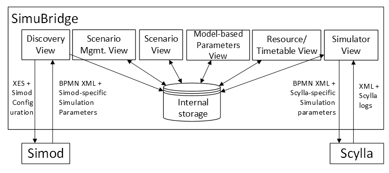

# SimuBridge--Main <br><sub><!----></sub>

## :information_source: About
This is the main application subrepository for the [SimuBridge](https://github.com/INSM-TUM/SimuBridge) project. It contains the source code for the web application that is the heartpice of the project. Please refer to the [root repository](https://github.com/INSM-TUM/SimuBridge) for overall project documentation.

This readme focusses on the technical details of the application and presents instructions how to run the application in isolation.


## :hammer_and_wrench: How to run it

### As Part of Docker-Compose (recommended) 
We recommend to start the SimuBridge application as part of the docker-compose of the [SimuBridge root project](https://github.com/INSM-TUM/SimuBridge). Please refer to the instructions there.

This way, the process miner(s) and simulator(s) SimuBridge interacts with are also running.

### Stand-alone
SimuBridge can also run standalone. This can be useful for development purposes, or if no integration with process miners or simulators is wanted.

First, clone this repository with
``` console
git clone git@github.com:INSM-TUM/SimuBridge--Main.git
```

#### As Docker container
To run SimuBridge as standalone docker container, first build the container by navigáting to the repository folder and running
``` console
docker build -t simulation-bridge:1.0.0 .
```
This builds the image which can then be instantiated using
``` console
docker run -it -p 3000:3000 simulation-bridge:1.0.0
```
SimuBridge is then available under `localhost:3000`

#### Run from source (development purposes)
To build SimBridge from source for development, first the dependency packages need to be installed. This needs node to be installed, and is done by navigating to the repository folder and running
```console
npm install --legacy-peer-deps
```
The application can then be started via
```console
npm run client
```


## 📦️ Components
The web application is split into multiple pages, each with dedicated purpose.
Notably, the discovery and simulator views interact with the external process discovery and simulation tools, respectively.




We built the application using the Javascript library React, using the Chakra-UI design framework to ensure a modern look.

The application stores some information in the session storage, namely which projet is currently edited. Most persistence, however, happens using the browser [IndexedDB API](https://developer.mozilla.org/en-US/docs/Web/API/IndexedDB_API), to ensure also large data, such as event logs, can be handled.
